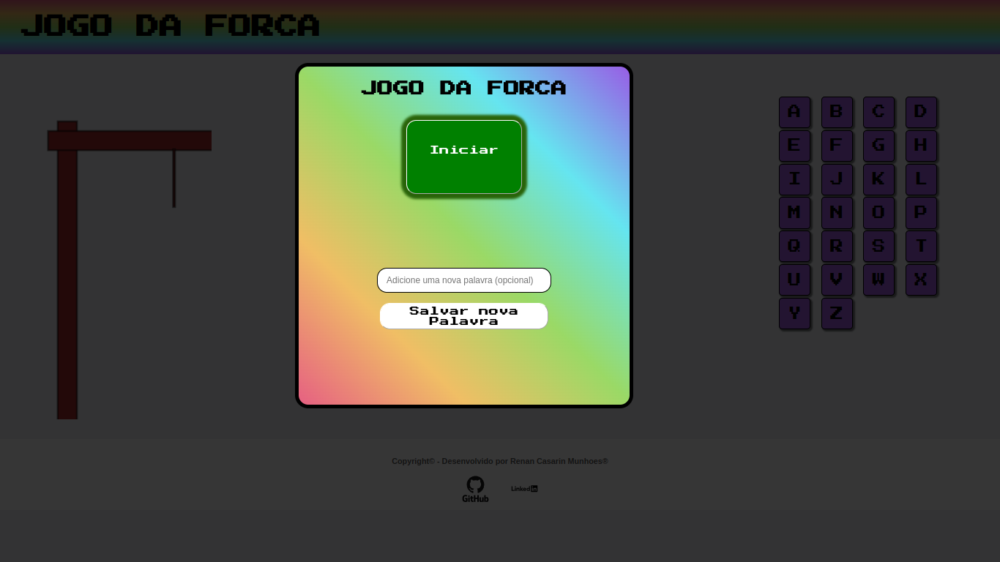

## Challenge Oracle Alura

#### Projeto sprint 01 do Challenge de Iniciante em Programação da Alura + Oracle equipe ONE. Para esse desafio, foi utilizado HTML, CSS e Javascript sem o uso de frameworks.

#### Foi utilizado conhecimentos adquiridos nos cursos:
* Curso Online Lógica de programação I e II : Os primeiros programas com Javascript e HTML | Alura
* Curso Online Git e Github: Controle e compartilhe seu código | Alura

  

### Visualização do projeto:
Você pode vizualizar o projeto no link: http://munhoesrc.me/Challenge-Oracle-Alura
